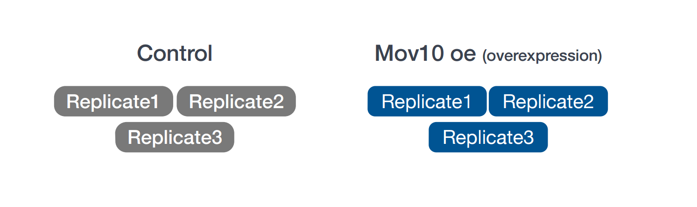

## Learning Objectives

-   Describe the example RNA-seq experiment and its objectives.
-   Demonstrate strategies for good data management and project organization.

## The Dataset

The dataset we are using for this workshop is part of a larger study described in [Kenny PJ et al., *Cell Rep* 2014](http://www.ncbi.nlm.nih.gov/pubmed/25464849).
The authors are investigating interactions between various genes involved in Fragile X syndrome, a disease of aberrant protein production, which results in cognitive impairment and autistic-like features.
**The authors sought to show that RNA helicase MOV10 regulates the translation of RNAs involved in Fragile X syndrome.**

### Raw data

From this study we are using the [RNA-seq](http://www.ncbi.nlm.nih.gov/geo/query/acc.cgi?acc=GSE50499) data which is publicly available in the [Sequence Read Archive (SRA)](https://www.ncbi.nlm.nih.gov/sra/?term=SRP029367).

> **NOTE:** If you are interested in how to obtain publicly available sequence data from the SRA we have some materials on this [linked here](https://hbctraining.github.io/Accessing_public_genomic_data/lessons/downloading_from_SRA.html).

### Metadata

In addition to the raw sequence data we also need to collect **information about the data**, also known as **metadata**.
We are usually quick to want to begin analysis of the sequence data (FASTQ files), but how useful is it if we know nothing about the samples that this sequence data originated from?

Some relevant metadata for our dataset is provided below:

-   The RNA was extracted from **HEK293F cells** that were transfected with a **MOV10 transgene**, **MOV10 siRNA**, or an **irrelevant siRNA**. (*For this workshop we won't be using the MOV10 knock down samples.*)
-   The libraries for this dataset are **stranded** and were generated using the standard Tru-seq prep kit (using the dUTP method).
-   Sequencing was carried out on the **Illumina HiSeq-2500** and **100bp single end** reads were generated.
-   The full dataset was sequenced to **\~40 million reads** per sample, but for this workshop we will be looking at a small subset on chr1 (\~300,000 reads/sample).
-   For each group we have three replicates as described in the figure below.

<p align="center">



</p>

## Implementing data management best practices

In a [previous lesson](https://hbctraining.github.io/Intro-to-rnaseq-hpc-salmon-flipped/lessons/04a_data_organization.html) we describe the data lifecycle and the **different aspects to consider when working on your own projects**.
Here, we implement some of those strategies to get ourselves setup before we begin with any analysis.

<p align="center">


</p>

*Image acquired from the [Harvard Biomedical Data Management Website](https://datamanagement.hms.harvard.edu/data-lifecycle)*

### Planning and organization

For each experiment you work on and analyze data for, it is considered best practice to get organized by creating a planned storage space (directory structure).
We will start by creating a directory that we can use for the rest of the workshop.
First, make sure that you are in your home directory.

``` bash
$ cd
$ pwd
```

This should return `/data/$USER/rc_training`.
Create the directory `rnaseq` and move into it.
***We will need to edit this directory path based on how Biowulf wants us to organize things.***

``` bash
$ mkdir rnaseq
$ cd rnaseq
```

Next, we will create a project directory and set up the following structure to keep our files organized.

``` bash
rnaseq
  ├── logs
  ├── meta
  ├── raw_data  
  ├── results
  └── scripts
```

*This is a generic structure and can be tweaked based on personal preference and the analysis workflow.*

-   `logs`: to keep track of the commands run and the specific parameters used, but also to have a record of any standard output that is generated while running the command. ***Not totally sure we need this one if we are keeping a work log***
-   `meta`: for any information that describes the samples you are using, which we refer to as [metadata](https://datamanagement.hms.harvard.edu/metadata-overview).
-   `raw_data`: for any **unmodified** (raw) data obtained prior to computational analysis here, e.g. FASTQ files from the sequencing center. We strongly recommend leaving this directory unmodified through the analysis.
-   `results`: for output from the different tools you implement in your workflow. Create sub-folders specific to each tool/step of the workflow within this folder.
-   `scripts`: for scripts that you write and use to run analyses/workflow.

``` bash
$ mkdir logs meta raw_data results scripts
```

> #### File naming conventions
>
> Another aspect of staying organized is making sure that all the directories and filenames for an analysis are as consistent as possible.
> You want to avoid names like `alignment1.bam`, and rather have names like `20170823_kd_rep1_gmap-1.4.bam` which provide a basic level of information about the file.
> [This link](https://datamanagement.hms.harvard.edu/file-naming-conventions) and [this slideshow](http://www2.stat.duke.edu/~rcs46/lectures_2015/01-markdown-git/slides/naming-slides/naming-slides.pdf) have some good guidelines for file naming dos and don'ts.

### Documentation: Worklog and README files

In your lab notebook, you likely keep track of the different reagents and kits used for a specific protocol.
Similarly, recording information about the tools used in the workflow is important for documenting your computational experiments.

Here are some things you might want to make a note of:

-   **Make note of the software you use.** Do your research and find out what tools are best for the data you are working with.
    Don't just work with tools that you are able to easily install.

-   **Keep track of software versions.** Keep up with the literature and make sure you are using the most up-to-date versions.

-   **Record information on parameters used and summary statistics** at every step (e.g., how many adapters were removed, how many reads did not align)

-   **Test datasets:** A general rule of thumb is to test on a single sample or a subset of the data before running your entire dataset through.
    This will allow you to debug quicker and give you a chance to also get a feel for the tool and the different parameters.

-   **Error and log messages**: Different tools have different ways of reporting log messages to the terminal.
    You might have to experiment a bit to figure out what output to capture.
    You can redirect standard output with the `>` symbol which is equivalent to `1> (standard out)`; other tools might require you to use `2>` to re-direct the `standard error` instead.

#### Creating a Worklog

The BSPC uses a *Work Log* for each project that they work on.
This is a file that lives in the top directory for a project (i.e. `rnaseq` in our case), and has the following attributes:

-   Named `WORKLOG.rst` to make it easy to find across projects
-   Use ReStructured Text format (`.rst` files), because this allows for more flexible documentation and parsing down the line
-   Start each entry with a date, in YYYY-MM-DD format, underlined with hyphens
-   Then a blank line
-   Then your username prefixed with an \@
-   Then arbitrary text describing what you did that day.
-   Keeps everything in chronological order, so the latest entry is at the bottom

For example, the top of my Work Log for the `rnaseq` project looks like:

``` bash
2024-10-03
----------

@changes

- Created directory structure, README, and Work Log
```

The audience is you (or another lab member) 2 years from now when everyone has forgotten about the project and now needs to start working on it again.
As you are writing, it will feel like you are writing too much or adding way too much detail.
You are not.
**The future you will thank you.**

Feel free to keep an informal, conversational tone.
This is not a public document.
*But do get in the habit of adding a note each time you work on a project!*

#### README files

After setting up the directory structure it is useful to have a [**README file**](https://datamanagement.hms.harvard.edu/readme-files) **within your project directory**.
This is a plain text file containing a short summary about the project and a description of the files/directories found within it.
An example README is shown below.
It can also be helpful to include a README within each sub-directory with any information pertaining to the analysis.

```         
## README ##
## This directory contains data generated during the Introduction to RNA-seq workshop
## Date: 

There are five subdirectories in this directory:

raw_data : contains raw data
meta:  contains...
logs:
results:
scripts:
```

------------------------------------------------------------------------

**Exercise**

1.  Take a moment to create a README for the `rnaseq/` folder (hint: use `vim` to create the file). Give a short description of the project and brief descriptions of the types of files you will be storing within each of the sub-directories.
2.  Use the same strategy to create a `WORKLOG.rst file` and add your first entry about what you just accomplished.

------------------------------------------------------------------------

### Obtaining data

Let's populate the `rnaseq/` project with some data.
Since we are taking this data from an external example, originally hosted at Harvard HPC, so a simple copy command (`cp`) will not suffice.
To copy it over we are now going to use the `wget` command and a direct link to a zipped file, then unzip this file to get the raw sequencing files from amongst other files included in their lesson.

``` bash
$ # This is kind of annoying and unrealistic so let's put this somewhere on Biowulf or something else more realistic!
$ # Start this in your rnaseq directory.
$ wget https://www.dropbox.com/s/x66jksdd4jklpdw/unix_lesson.zip
$ unzip unix_lesson.zip
$ cp unix_lesson/raw_fastq/*.fq 
```

Now the structure of `rnaseq/` should look like this:

``` bash
rnaseq
  ├── logs
  ├── meta
  ├── raw_data
  │   ├── Irrel_kd_1.subset.fq
  │   ├── Irrel_kd_2.subset.fq
  │   ├── Irrel_kd_3.subset.fq
  │   ├── Mov10_oe_1.subset.fq
  │   ├── Mov10_oe_2.subset.fq
  │   └── Mov10_oe_3.subset.fq
  ├── README.txt
  ├── results
  └── scripts
```

Okay, we are all set to begin the analysis!

------------------------------------------------------------------------

*This lesson has been developed by members of the teaching team at the [Harvard Chan Bioinformatics Core (HBC)](http://bioinformatics.sph.harvard.edu/). These are open access materials distributed under the terms of the [Creative Commons Attribution license](https://creativecommons.org/licenses/by/4.0/) (CC BY 4.0), which permits unrestricted use, distribution, and reproduction in any medium, provided the original author and source are credited.*

-   *The materials used in this lesson were derived from work that is Copyright © Data Carpentry (<http://datacarpentry.org/>). All Data Carpentry instructional material is made available under the [Creative Commons Attribution license](https://creativecommons.org/licenses/by/4.0/) (CC BY 4.0).*
-   *Adapted from the lesson by Tracy Teal. Original contributors: Paul Wilson, Milad Fatenejad, Sasha Wood and Radhika Khetani for Software Carpentry (<http://software-carpentry.org/>)*
